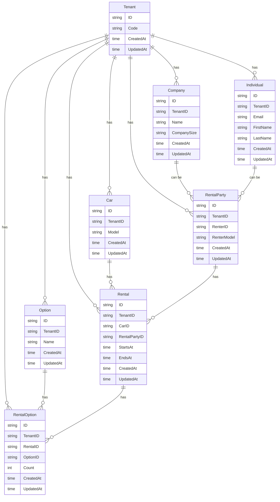

# Entity Relationship Diagram

This system represents a SaaS platform for car rental companies.

Key characteristics of this system:

- **SaaS Platform**: Multi-tenant architecture where each tenant is a separate car rental company
- **Polymorphic Association**: Renter can be either a Company or an Individual (demonstrated through the RentalParty entity)
- **Many-to-Many Association**: Rental and Option entities are connected through the RentalOption entity, with composite indexing applied

