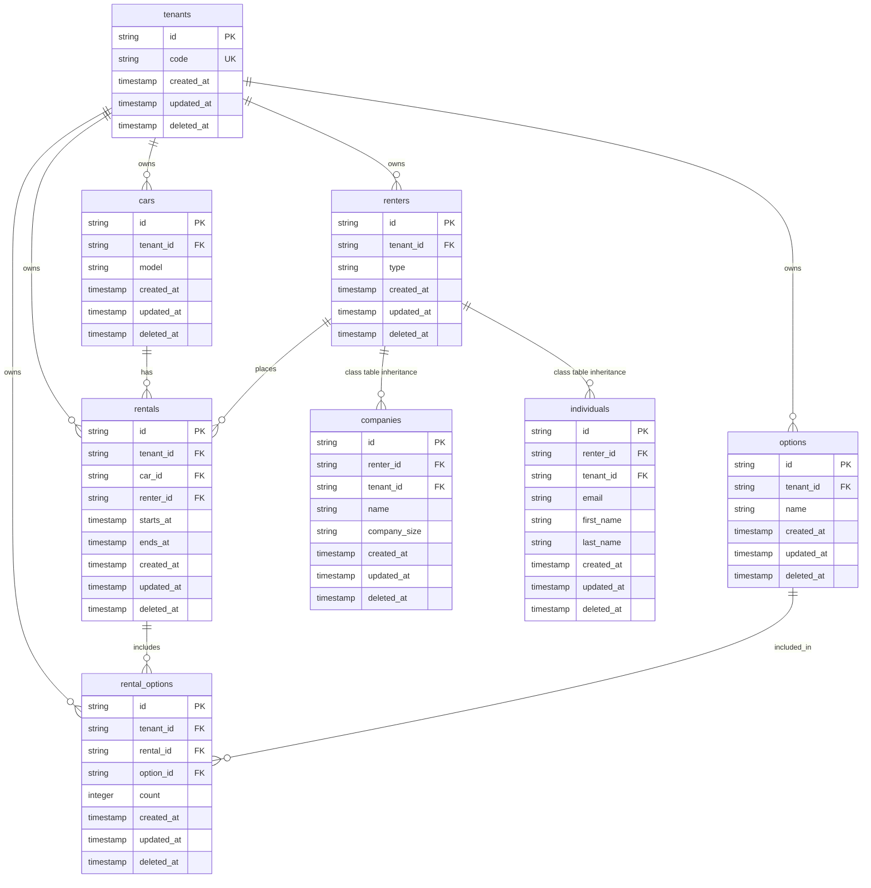

# ER Diagram

This system represents a SaaS platform for car rental companies.

Key characteristics of this system:

- **SaaS Platform**: Multi-tenant architecture where each tenant is a separate car rental company
- **Class Table Inheritance**: Renter is implemented using Class Table Inheritance pattern where Company and Individual are specialized types of Renter
- **Many-to-Many Association**: Rental and Option entities are connected through the RentalOption entity, with a composite unique index applied to RentalID and OptionID to ensure that the same option cannot be attached to a rental more than once

> **Note**: For simplicity, common columns such as `ID`, `CreatedAt`, and `UpdatedAt` have been omitted from the diagram below. Additionally, the explicit associations with the Tenant entity have been removed, though in the actual implementation all entities are associated with a Tenant in a multi-tenant architecture.

# ER Diagram (Full Version)

